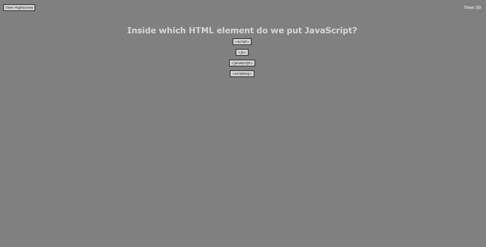

# Code-Quiz
Challenge 4 for the FSF Web Development bootcamp, which involved creating a coding quiz with a leaderboard.

## Description
The problem in Challenge 4 is to create a quiz about coding in JavaScript for users to engage with. The quiz also needed to have a leaderboard for users to be able to see after submitting there score or by pressing a button on the page.

## Preview 

## Usage
To view the webpage, go to https://allenwang1999.github.io/Code-Quiz using your browser and click the start quiz button to start the quiz.

## License
MIT License; refer to <a href="LICENSE">LICENSE</a> file in the repo.